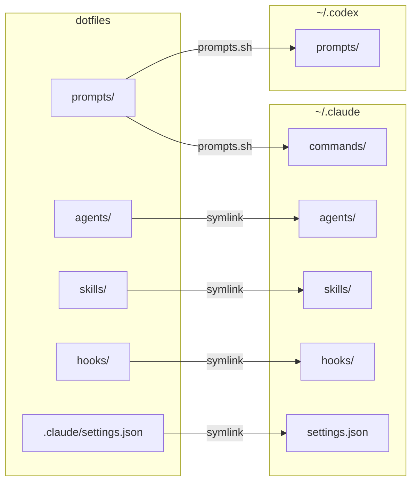

# dotfiles

Personal macOS development environment configuration.

```python
class GitLabReviewResponse(BaseModel):
    """RDFormatのレスポンススキーマ"""

    source: Source = Field(
        default_factory=lambda: Source(name="MU-Copilot"),
        description="この診断結果のソース情報",
    )
    diagnostics: list[Diagnostic] = Field(
        default_factory=list,
        description="ツールによって報告された診断",
    )
    warnings: list[str] = Field(
        default_factory=list,
        description="実行中に発生した警告メッセージ",
    )
```

## Getting Started

```shell
# Initial setup (Homebrew, symlinks, GitHub auth)
./bootstrap.sh

# Sync prompts to ~/.codex and ~/.claude
./prompts.sh

# Install GitHub CLI extensions
./gh/gh-bundle.sh
```

## Repository Structure

```
.config/          XDG configs (nvim, zsh, git, alacritty, ghostty, etc.)
.claude/          Claude AI configuration
.hammerspoon/     macOS automation
agents/           Agent definitions
skills/           Claude skills
prompts/          Prompt templates
gh/               GitHub CLI extensions
hooks/            Dev workflow hooks
docs/             Documentation
```

## Managed Tools

**Shell**: Zsh + Znap + Powerlevel10k

**Editor**: Neovim with LSP

**Terminals**: Alacritty, Ghostty, WezTerm

**VCS**: Git, Jujutsu, GitHub CLI

**Languages**: Node.js (nvm), Python (pyenv), Go, PHP

**Dev Tools**: Docker, Terraform, pre-commit

## AI Tools Configuration

Shared configuration for Codex and Claude Code:



- `./prompts.sh` copies prompts to both `~/.codex` and `~/.claude/commands`
- Symlinks (created via `.zshrc`) connect agents, skills, hooks, and settings
